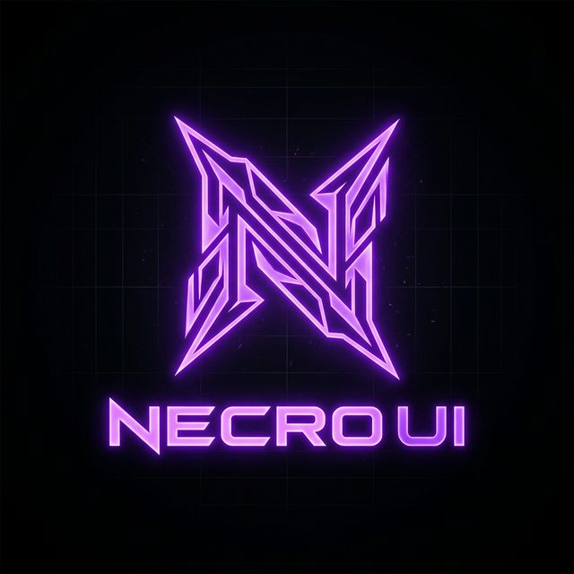

# NecroUI Library V2 Pro

A highly aesthetic, modular, and optimized user interface library for Roblox script developers. Inspired by premium UI designs with a deep focus on custom themes, liquid gradient animations, and pixel-perfect element alignments.



##  Особенности (Features)
-  **Liquid Neon Engine:** Математически плавная анимация градиентов.
-  **Responsive Safe-Grid:** Принудительные колонки.
-  **Умный Поиск (Smart Search):** Выпадающие списки (Dropdowns) поддерживают встроенный поиск функций при большом массиве опций.
-  **Тематические пресеты:** Интерфейс плавно подстраивается под смену темы (`Color3:lerp()`).
-  **Cloud Auto-Update:** Библиотека подгружается с GitHub и всегда остается актуальной (`?t=tick()`).
-  **Система Зависимостей (Dependencies):** Элементы могут программно блокироваться в зависимости от состояния других переключателей.
-  **Anti-Leak (Защита UI):** Принудительное скрытие рендеринга окна от античитов через `gethui()`.
-  **Без Утечек Памяти (Garbage Collector):** Метод `UI:Unload()` автоматически очищает фоновые процессы, экономя ваши FPS.

---

##  Полная Документация (API Reference)

### 1. Подключение и Создание Окна (Initialization)
В библиотеку уже вшита система сохранения конфигов (JSON), загрузочный экран и глобальная система уведомлений.
```lua
local NecroUI = loadstring(game:HttpGet("https://raw.githubusercontent.com/bad-tr1p1/NecroUI-Library/main/init.lua?t=" .. tostring(tick())))()

local Window = NecroUI:CreateWindow({
    Name = "NecroUI V2 Pro",                     -- Название в шапке
    ThemeColor = Color3.fromRGB(90, 19, 95),     -- Базовый цвет свечения
    LoadingScreen = true,                        -- Включить стартовую анимацию
    SaveConfig = true,                           -- Включить авто-систему конфигов (System Tab)
    ConfigFolder = "NecroConfigs"                -- Название папки в Workspace
})
```

### 2. Вкладки и Группы (Tabs & Groups)
Интерфейс разделен на левую (`"Left"`) и правую (`"Right"`) колонки, которые автоматически подгоняют свой размер и никогда не вылезают за края экрана.
```lua
-- Создание вкладки (Поддерживаются иконки из Roblox rbxassetid)
local CombatTab = Window:CreateTab("Aimbot", "rbxassetid://6031100237")

-- Создание групп внутри вкладок
local MainAimGroup = CombatTab:CreateGroup("Main Settings", "Left")
local VisualGroup = CombatTab:CreateGroup("Drawings", "Right")
```

---

### 3. Базовые Элементы Управления (Basic Elements)

####  Переключатели (Toggles)
Анимированные красивые свитчи для включения функционала:
```lua
MainAimGroup:CreateToggle("Aim Enabled", false, function(value)
    print("Aimbot Is Now: ", value)
end)
```

#### 📍 Ползунки (Sliders)
Плавные слайдеры с округлением и поддержкой ручного ввода.
```lua
MainAimGroup:CreateSlider("FOV Size", 1, 360, 50, function(value)
    print("FOV Changed: ", value)
end)
```

#### ⌨ Бинды Клавиш (Keybinds)
Воркер клавиш, умеющий ждать нажатия от пользователя.
```lua
MainAimGroup:CreateKeybind("Trigger Key", Enum.KeyCode.E, function(key)
    print("Trigger Keyset: ", key)
end)
```

####  Текстовые поля (TextBox)
Многофункциональный инпут, поддерживающий как обычный ввод, так и многострочный.
```lua
MainAimGroup:CreateTextBox("Player Name", "Enter Target...", "", false, function(text)
    print("Target Set To: ", text)
end)
```

#### 🕹 Кнопки (Buttons)
Интерактивные кнопки с эффектами нажатия.
```lua
MainAimGroup:CreateButton("Clear Target", function()
    print("Target Cleared!")
end)
```

---

### 4. Продвинутые Элементы Управления (Advanced Elements)

####  Выпадающие Списки (Dropdowns / Search)
Механизм меню поверх всех окон (`ZIndexBehavior.Global`). Включает в себя поддержку **Встроенного Поиска** и множественного выбора (Multi-Select).

**Одиночный выбор (Single Select):**
```lua
MainAimGroup:CreateDropdown("Target Part", {"Head", "Torso", "Neck"}, "Head", false, function(value)
    print("Target Part: ", value)
end)
```

**Множественный выбор (Multi Select) с Поиском:**
```lua
local playersList = {"Player1", "Player2", "Anakin", "Luke", "Vader", "ObiWan", "Yoda"}

MainAimGroup:CreateDropdown("Whitelist", playersList, {"Player1"}, true, function(selectedTable)
    for index, name in pairs(selectedTable) do
        print("Whitelisted: ", name)
    end
end)
```

####  Выбор Цвета (ColorPickers)
Математически точная палитра (Hue/Saturation/Value) для кастомизации визуала игры. Рендерится также поверх других элементов.
```lua
VisualGroup:CreateColorPicker("ESP Color", Color3.fromRGB(255, 0, 0), function(color)
    print("New Color Set!")
end)
```

---

### 5. Модификаторы Элементов (Modifiers)
Библиотека поддерживает присоединение логики к уже существующим элементам. Это позволяет делать интерфейс "умным" и компактным.

**Встроенный Keybind прямо в Toggle:**
Вам не нужно создавать отдельный бинд. Он приклеится прямо в строку Тоггла!
```lua
MainAimGroup:CreateToggle("Auto Shoot", false, function(value)
    print("Auto Shoot: ", value)
end):AddKeybind(Enum.KeyCode.Q)
```

**Система Зависимостей (Dependencies):**
Блокирует или скрывает элементы, если главный тумблер выключен. Предотвращает возможность кликать на слайдеры аимбота, если сам аимбот выключен.
```lua
MainAimGroup:CreateSlider("Smoothing", 1, 10, 5, function(v) end):AddDependency("Aim Enabled", true)
MainAimGroup:CreateColorPicker("FOV Color", Color3.new(1,1,1), function() end):AddDependency("Aim Enabled", true)
```

---

### 6. Встроенная Система Уведомлений (Notifications)
Если вам нужно оповестить игрока о чем-то (например, "Config Loaded"), используйте глобальный метод библиотеки:
```lua
NecroUI:Notify({
    Title = "Aimbot",
    Text = "Target has left the game!",
    Duration = 3 -- Время в секундах
})
```

---

##  Безопасность и Обновления (Security & Updates)
- **Архитектура Anti-Leak:** Графический интерфейс загружается в скрытые области памяти через обходной путь `gethui()` (на поддерживающих экзекуторах). Это предотвращает видимость скрипта любыми сканерами `CoreGui` на стороне сервера (серверными анти-читами) и прячет элементы от Dex Explorer.
- **Очистка Памяти (Garbage Collection):** В библиотеку встроен мощный сборщик мусора. При выгрузке меню системным вызовом `UI:Unload()` ядро автоматически отсоединяет все `RBXScriptConnection`, `RunService` и анонимные слушательные циклы. Это исключает классические сценарии "утечки памяти" (Memory Leaks).
- **Обновления:** Загрузка через `game:HttpGet` по ссылке с окончанием `?t=tick()` обходит кэш и всегда подгружает новейшие исправления напрямую с GitHub (Continuous Delivery).
- **Безопасность конфигураций:** Конфигурации сохраняются локально (`writefile`) на устройстве пользователя. Подробности читайте в файле `SECURITY.md`.
- **Ошибки:** Встроенная валидация загрузки и парсинга JSON (`pcall`) защищает скрипт от непредвиденных крашей при повреждении конфигураций игрока.

## 📄 Лицензия (License)
Проект распространяется по лицензии **MIT License**. Подробнее см. в файле `LICENSE`.

**Отказ от ответственности**: Данный проект предоставляется (as is), без каких-либо гарантий. Вся ответственность за использование скриптов на базе **NecroUI** полностью лежит на вас.
